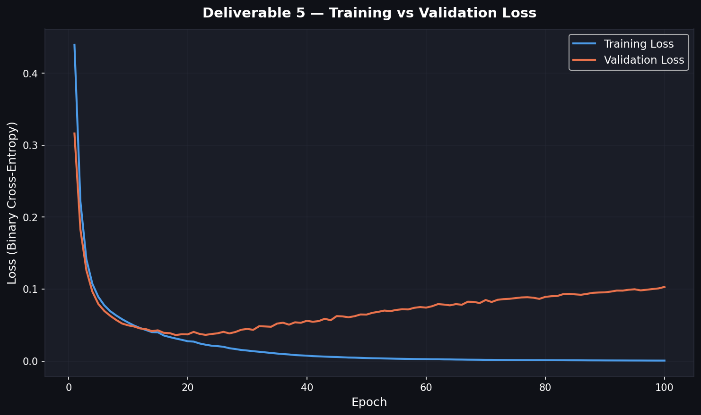

# Deliverable 5 — Feed-Forward Network (Binary Classification) Outputs

## Loss Plot (Training vs Validation)

## Fit Assessment

| Metric | Value |
|---|---|
| Final Training Loss | 0.0007 |
| Final Validation Loss | 0.1030 |
| Best Validation Loss | 0.0361 (epoch 18) |
| Verdict | **Overfitting** |

The validation loss is notably higher than the training loss (gap = 0.1023) and rose after its minimum (rise = 0.0669). The model has memorised training patterns that do not generalise. Consider adding dropout, reducing model capacity, or using early stopping.

## Test Set Metrics

| Metric | Value |
|---|---|
| Accuracy | 0.9651 |
| Precision | 0.9811 |
| Recall | 0.9630 |
| F1 Score | 0.9720 |

---

# Deliverable 6 — SMS Spam TF-IDF + Logistic Regression + MLP Outputs

## Model Comparison (Logistic Regression vs Keras MLP)

| Model | Accuracy | Precision | Recall | F1 Score |
|---|---|---|---|---|
| Logistic Regression | 0.9629 | 1.0000 | 0.7232 | 0.8394 |
| Keras MLP | 0.9844 | 0.9901 | 0.8929 | 0.9390 |

## Top 10 Most Informative Words (Logistic Regression)

| Rank | Word | Coefficient |
|---|---|---|
| 1 | txt | 4.4006 |
| 2 | claim | 3.3269 |
| 3 | stop | 3.3119 |
| 4 | www | 3.2872 |
| 5 | uk | 3.2664 |
| 6 | mobile | 3.1137 |
| 7 | reply | 3.0855 |
| 8 | service | 2.9777 |
| 9 | free | 2.9038 |
| 10 | text | 2.7780 |

---

# Deliverable 7 — Replace TF-IDF with Embeddings Outputs

## Embeddings vs TF-IDF Comparison

| Model | Accuracy | Precision | Recall | F1 Score |
|---|---|---|---|---|
| LR (TF-IDF) | 0.9629 | 1.0000 | 0.7232 | 0.8394 |
| MLP (TF-IDF) | 0.9844 | 0.9901 | 0.8929 | 0.9390 |
| LR (Embedding) | 0.9605 | 0.8264 | 0.8929 | 0.8584 |
| MLP (Embedding) | 0.9761 | 0.9182 | 0.9018 | 0.9099 |

## Hypothesis on Performance Differences

TF-IDF and averaged word embeddings capture fundamentally different textual signals, and their relative effectiveness depends on the nature of the task.

TF-IDF represents each document as a sparse, high-dimensional vector weighted by term frequency and inverse document frequency. This makes it extremely sensitive to the presence of specific discriminative keywords. SMS spam detection is largely a keyword-driven problem: spam messages cluster around distinctive tokens such as "free", "win", "prize", "claim", and "txt" that are rare in legitimate messages. TF-IDF directly encodes the importance of these tokens, giving classifiers sharp decision boundaries.

spaCy's pre-trained word embeddings (en_core_web_md, 300-dimensional) capture semantic similarity — words with related meanings receive nearby vectors. However, creating a document-level representation by averaging all word vectors has two key limitations: (1) it dilutes the signal from rare but highly informative spam keywords among common everyday words, and (2) it discards word-order and compositional information entirely. Additionally, the pre-trained vectors were learned from general web text and may not optimally represent the idiosyncratic vocabulary of SMS spam.

Therefore, TF-IDF is expected to perform comparably or better than averaged embeddings on this task because spam detection rewards exact lexical matching over semantic generalization. If embeddings still achieve reasonable accuracy, it indicates that the distributional properties of spam vocabulary are distinctive enough to survive the averaging process — but the inherent compression from thousands of TF-IDF features to 300 embedding dimensions inevitably discards task-relevant information.
